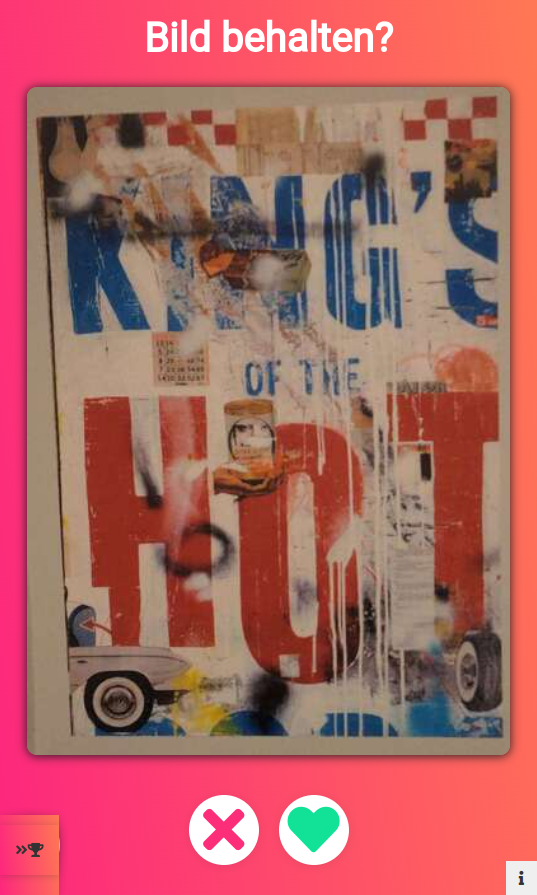

# q216_voting_site
project for Mietergewerkschaft Berlins Q216 Project <a href="https://mg-berlin.org/q216/"> (Website)</a>

## Demo

<p align="center">
  
  
</p>

## Features

image voting side with vanilla php and js
- optimized for mobile use
- with score board to show users the current top picks
- added cookies to prevent (with reasonalble effort) users from voting multiple times
- added images and topimages side for data analysis

## Installation

1. Clone the repository:

   ```bash
   git clone https://github.com/nicolaaaa/q216_voting_site.git
   ```
2. Install Docker and Docker-Compose 
3. Run the following command in the root directory of the project:
   ```bash
   docker-compose up
   ```
4. Open the `localhost:8080` in your browser.

## Technologies Used

- Docker
- HTML
- CSS
- JavaScript 
- PHP
- MYSQL
- NGINX
